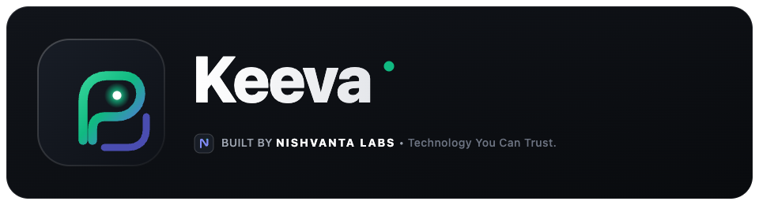
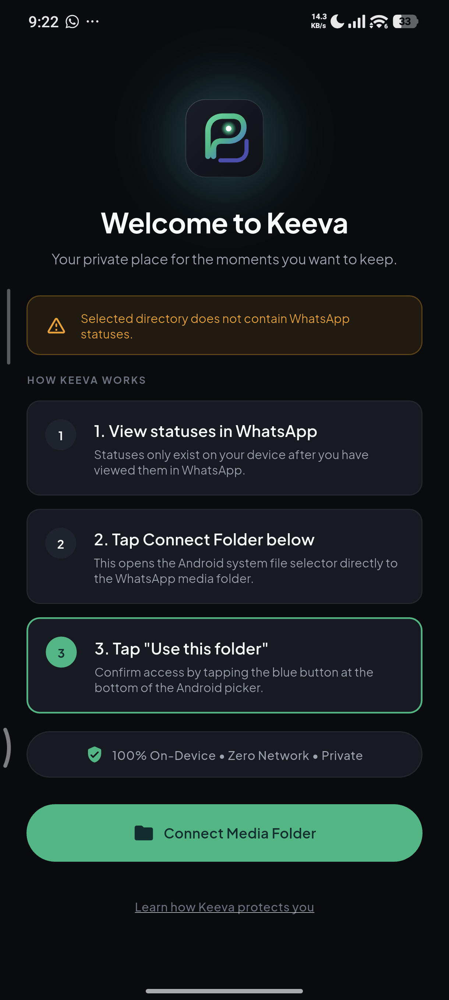
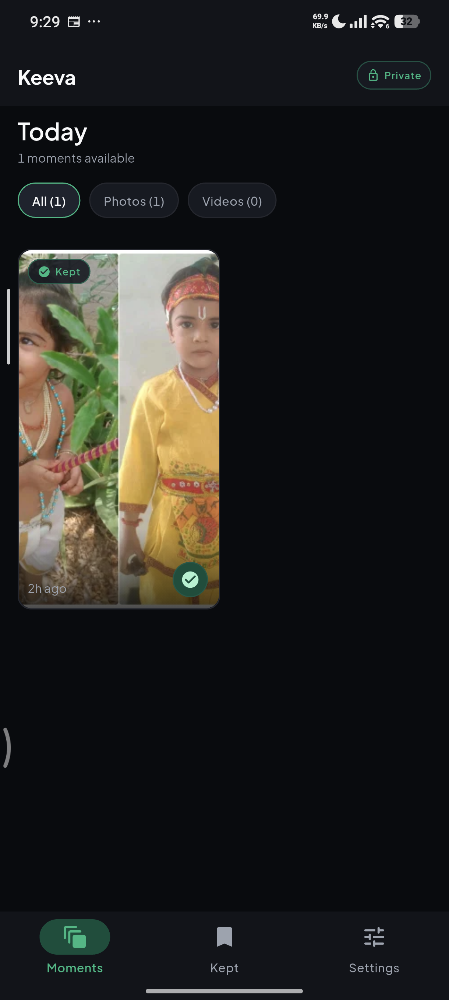
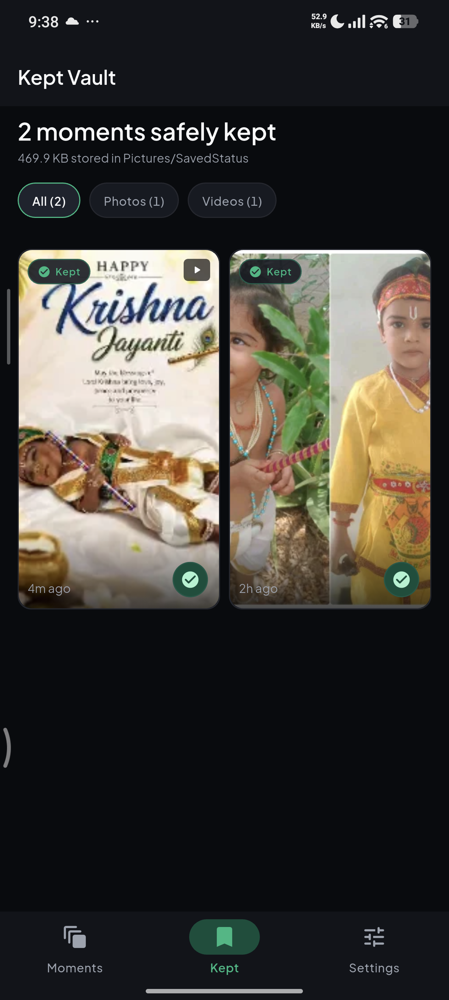
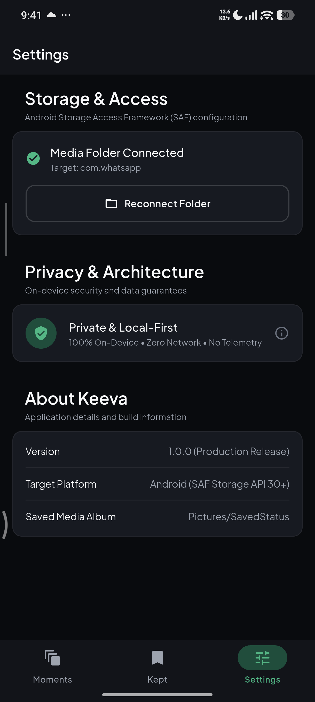

# Keeva

Private, local-first Android app for viewing and saving WhatsApp status media, built with Flutter.

<p align="center">
  
</p>

<p align="center">
  <a href="LICENSE"></a>
</p>

---

## Overview

**Keeva** is a local-first mobile application for Android designed to browse, preview, and save ephemeral WhatsApp status media directly on your device, built by **Nishvanta Labs** (*Technology You Can Trust.*).

Status media on modern Android devices (Android 11+) is protected under Android's Scoped Storage model. Keeva addresses this by utilizing Android's standard **Storage Access Framework (SAF)**: users explicitly choose and grant permission to their status folder via Android's native system folder picker. Keeva operates entirely offline with no background tracking, third-party analytics, or external server dependencies.

---

## Screenshots

| Onboarding & Folder Setup | Moments Feed | Kept Vault | Settings |
|:---:|:---:|:---:|:---:|
|  |  |  |  |

---

## Features

- **Moments Feed**: Browse status photos and videos in an organized, responsive media grid.
- **Media Filtering**: Seamlessly filter between All, Photos, and Videos tabs.
- **Fullscreen Photo Viewer**: Interactive image viewer with pinch-to-zoom, pan, and immersive viewing modes.
- **Integrated Video Player**: In-app video playback with intuitive transport controls, progress tracking, and mute toggles.
- **Keep Media**: Save status items permanently to the on-device Kept Vault before they expire.
- **Kept Vault**: Dedicated gallery to review, manage, and share preserved media at any time.
- **Media Information**: Inspect technical metadata including file dimensions, file size, timestamps, and MIME types.
- **Android System Sharing**: Share photos and videos directly to other apps using native Android share intents.
- **Storage Access Framework Integration**: Compliant folder access requiring explicit user directory authorization via `ACTION_OPEN_DOCUMENT_TREE`.
- **Customizable Appearance**: Material 3 theming with support for System, Light, and Dark display modes.
- **Local Persistence**: Securely persists folder tree URIs and user preferences on-device across sessions.

---

## Architecture

Keeva is structured according to clean, feature-first architectural boundaries:

```text
lib/
├── app/                  # Application bootstrap, routing, and theme configuration
├── presentation/         # Flutter UI: Screens, reusable components, and view models
│   ├── onboarding/       # SAF authorization and introduction flow
│   ├── moments/          # Status discovery feed and filter tabs
│   ├── viewer/           # Fullscreen photo viewer & video player
│   ├── kept/             # Preserved media vault gallery
│   ├── settings/         # Preferences, folder management, and diagnostics
│   └── shell/            # Root navigation scaffold and bottom bar
├── application/          # State management via Riverpod controllers and notifiers
├── domain/               # Core business models (MediaItem, KeptMedia, FolderConnection)
├── data/                 # Repositories, metadata caching, and local storage data sources
├── platform/             # Platform channel contracts communicating with Android
└── core/                 # Shared utilities, error types, and design tokens
```

### Native Android Layer
Platform-specific storage integration is encapsulated within `android/app/src/main/kotlin/io/nishvanta/keeva/`:
- **SAF Document Access**: Uses Android's `DocumentFile` and `ContentResolver` APIs to query directory trees, read media streams, and take persistent URI permissions.
- **Scoped Media Storage**: Saves media directly to the user-selected local destination without requiring broad storage manager permissions (`MANAGE_EXTERNAL_STORAGE`).
- **Canonical Application Identity**: The application package name and namespace are `io.nishvanta.keeva`, engineered by Nishvanta Labs.

---

## Requirements

- **Flutter SDK**: `>= 3.13.2`
- **Dart SDK**: `^3.13.2`
- **Android SDK**:
  - Minimum SDK: API 26 (Android 8.0 Oreo)
  - Target SDK: API 35 (Android 15)
- **Java / JDK**: Version 17

---

## Getting Started

### 1. Clone the Repository
```bash
git clone https://github.com/mr-nishanth/keeva.git
cd keeva
```

### 2. Install Dependencies
```bash
flutter pub get
```

### 3. Run on a Connected Device or Emulator
```bash
flutter run
```
*Note: For complete functionality involving WhatsApp status media, test on a physical Android device or an emulator configured with WhatsApp media folders.*

---

## Testing & Quality Assurance

Run the test suite and static analysis tools locally:

```bash
# Run unit and widget tests
flutter test

# Run static code analysis
flutter analyze

# Verify code formatting
dart format --output=none --set-exit-if-changed lib test integration_test tool
```

---

## Building

Generate Android build artifacts using standard Flutter commands:

```bash
# Build debug APK
flutter build apk --debug

# Build profile APK
flutter build apk --profile

# Build release APK
flutter build apk --release

# Build release App Bundle (AAB)
flutter build appbundle --release
```

---

## Releases & Versioning

Versioning and GitHub Releases are automated through GitHub Actions using semantic versioning.

Releases are generated automatically when qualifying changes land on the `main` branch:
- `fix:` $\rightarrow$ **PATCH** release (e.g., `1.0.0` $\rightarrow$ `1.0.1`)
- `feat:` $\rightarrow$ **MINOR** release (e.g., `1.0.1` $\rightarrow$ `1.1.0`)
- `feat!:` or `BREAKING CHANGE:` $\rightarrow$ **MAJOR** release (e.g., `1.1.0` $\rightarrow$ `2.0.0`)

Contributors and maintainers do not manually edit version numbers or create Git release tags for standard releases. Each release strictly increments the platform build number and publishes verified release artifacts (APK, AAB, SHA-256 checksums, and iOS IPA when signing is provisioned).

For complete technical specifications, see [Versioning Documentation](docs/release/versioning.md) and [GitHub Releases Documentation](docs/release/github-releases.md).

---

## Privacy & Security

- **Local-First On-Device**: All media reading, preview caching, and saving operations execute strictly on your local device with zero external server dependencies.
- **No Remote Telemetry**: Keeva contains no third-party analytics libraries, advertising trackers, or external network requests.
- **Explicit Scoped Permissions**: Folder access is granted exclusively through Android's system file picker. Keeva cannot read files outside the directory authorized by the user.
- **Safe Operations**: Keeva never deletes, alters, or modifies original status media in the source directory.

For security policies and vulnerability reporting procedures, refer to [SECURITY.md](SECURITY.md).

---

## Contributing

Contributions, bug reports, and feature proposals are welcome. Please read [CONTRIBUTING.md](CONTRIBUTING.md) for development guidelines, code standards, and PR submission workflows.

---

## License & Attribution

- **Product:** Keeva
- **Developer:** Nishvanta Labs (*Technology You Can Trust.*)
- **Repository:** [mr-nishanth/keeva](https://github.com/mr-nishanth/keeva)
- **License:** [Apache-2.0](LICENSE) — see the [LICENSE](LICENSE) file for complete terms and conditions.

---

## Disclaimer

WhatsApp is a trademark of its respective owner. Keeva is an independent project and is not affiliated with or endorsed by WhatsApp or Meta.
