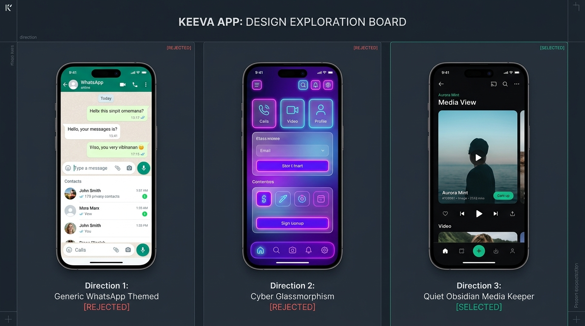

# Keeva Design System Specification

**Product:** Keeva (WhatsApp Status Saver → Premium Independent Identity)
**Document Status:** Production Design System Specification
**Phase:** Phase 2E-A (UI/UX Design System Discovery & Specification)
**Theme:** Quiet Obsidian + Aurora Mint
**Platform Target:** Android-First (Primary), iOS-Compatible (Secondary)
**Date:** September 2026

---

## 1. Executive Summary & Brand Identity

Keeva is a private, calm, media-first keeper for temporary moments, engineered by Nishvanta Labs.

```text
Parent Organization: Nishvanta Labs
Company Tagline:     Technology You Can Trust.
Product Name:        Keeva
Product Tagline:     Keep the moments that matter.
Design Metaphor:     Quiet Obsidian Media Vault
Core Experience:     Discover → Preview → Keep
Signature Action:    "Keep" (Never "Download" or "Save to Disk")
```

### 1.1 Brand Relationship & Hierarchy

```text
Nishvanta Labs (Parent / Creator Identity)
    │
    └── Keeva (Consumer Product Identity)
```

- **Hierarchy Rule:** "Nishvanta Labs builds Keeva" (not *"Keeva is a feature of Nishvanta Labs"*).
- **Product Autonomy:** Keeva operates independently as a consumer-facing product mark in mobile launchers, notifications, and application stores.
- **Creator Endorsement:** Nishvanta Labs provides organizational attribution in About screens, repository metadata, and open-source documentation.

### 1.2 Brand Personality & Tone
* **Calm:** Zero flashing badges, banner ads, high-saturation red warnings, or pushy prompts.
* **Private:** Local-first, zero internet permissions in production, transparent Storage Access Framework (SAF) folder isolation.
* **Premium:** Obsidian deep blacks (`#090B0E`), subtle 1px border crispness, fluid 120Hz spring physics, and restrained typography.
* **Fast:** 8.3ms active frame budget, instant native thumbnails, zero UI isolate blocking.
* **Trustworthy:** Honest technical boundaries, plain human language, clear security assurances.

### 1.3 Anti-Patterns (What Keeva & Nishvanta Labs are NOT)
* **NOT a WhatsApp clone:** No WhatsApp green (`#25D366`), no chat bubbles, no contact lists, no social styling.
* **NOT a generic file manager:** No raw paths, no hierarchical directory trees, no MIME-type lists.
* **NOT a download utility:** No downloading arrows, progress percentages in notification trays, or "downloader" branding.
* **NOT generic AI / crypto styling:** No generic AI brain icons, circuit lines, sheriff shields, padlock badges, or isometric cryptocurrency cubes.

### 1.4 Logo System, Clear Space & Sizing
* **Keeva Symbol:** 512×512 Squircle plate with continuous Inward Aperture Ribbon (`#34D399` → `#10B981` → `#6366F1`) and gleaming Preserved Spark at `(280, 200)`.
* **Nishvanta Labs Monogram:** 512×512 Geometric continuous "N" ribbon (`#818CF8` → `#6366F1` → `#4338CA`) with forward momentum beacon at `(352, 152)`.
* **Clear Space:** Maintain a minimum clear boundary of `0.5H` on all four sides of each mark.
* **Minimum Rendering Sizing:**
  - `16px`: System tray / favicons (monochrome silhouette without plate container).
  - `24px`: In-app navigation icons.
  - `48px`: App bar branding.
  - `64px`: Onboarding hero badge.
  - `512px`: Launcher store icon and vector canvas.
* **Monochrome Usage:** Both marks feature dedicated single-color dark (`#090B0E`) and reversed white (`#FFFFFF`) silhouette SVGs for monochrome printing, watermarks, and Android 13+ themed icon surfaces.
* **Misuse Rules:** Do not stretch, do not rotate, do not apply unapproved colors, do not add heavy blurred shadows, and do not merge the two marks into a hybrid glyph.

---

## 2. Visual Exploration & Direction Selection

Before formalizing the token architecture, three distinct visual directions were evaluated against the Keeva brand values and technical budgets.

```
┌─────────────────────────────────────────────────────────────────────────────────────────────┐
│                                VISUAL EXPLORATION BOARD                                     │
├──────────────────────────────┬──────────────────────────────┬───────────────────────────────┤
│ Direction 1: WhatsApp Themed │ Direction 2: Cyber Glass     │ Direction 3: Quiet Obsidian   │
│ [REJECTED]                   │ [REJECTED]                   │ [SELECTED]                    │
├──────────────────────────────┼──────────────────────────────┼───────────────────────────────┤
│ • WhatsApp green accents     │ • High-blur glassmorphism    │ • Deep obsidian (#090B0E)     │
│ • Chat bubble aesthetic      │ • Neon purple / pink glows   │ • Aurora Mint (#10B981)       │
│ • Floating action button (+) │ • Translucent frosted cards  │ • Restrained 1px boundaries   │
│ • Utility downloader styling │ • Heavy drop shadows         │ • 9:16 media-first heroism    │
│ • Confuses product identity  │ • Drops frames on 120Hz OLED │ • Flawless 120Hz AMOLED perf  │
└──────────────────────────────┴──────────────────────────────┴───────────────────────────────┘
```



### Evaluation Summary

1. **Direction 1: Generic WhatsApp-Themed Utility [REJECTED]**
   * *Rationale:* Adopts `#25D366` green, WhatsApp-style top navigation tabs, and download buttons. This confuses users into thinking the app is published by Meta, introduces legal trademark risks, and feels like a low-effort ad-supported downloader.
2. **Direction 2: Cyber / Neon Glassmorphism [REJECTED]**
   * *Rationale:* Heavy backdrop blurs (`BackdropFilter`) and multi-stop gradient borders incur severe GPU raster thread penalties during rapid grid fling scrolling on Android 120Hz AMOLED displays (exceeding the 8.3ms frame budget). Visually, high-saturation neon borders compete with user photos.
3. **Direction 3: Quiet Obsidian Media Keeper [SELECTED]**
   * *Rationale:* Eliminates visual noise. Background sits at deep obsidian (`#090B0E`), preventing AMOLED smearing while maximizing power efficiency. Media thumbnails take 90% of screen real estate. Single signature accent (Aurora Mint `#10B981`) provides unambiguous call-to-action ("Keep") with AAA contrast.

---

## 3. Brand Color Palette & Semantic Tokens

### 3.1 Dark Theme Palette (Obsidian + Aurora — Default)

```
CANVAS & SURFACES                   PRIMARY (AURORA MINT)          ACCENT (AURORA INDIGO)
┌───────────────────────────┐       ┌───────────────────────┐      ┌───────────────────────┐
│ #090B0E   Background      │       │ #10B981   Primary     │      │ #6366F1   Accent      │
│ #11141A   Surface L0 Nav  │       │ #34D399   Primary-Lt  │      │ #818CF8   Accent-Lt   │
│ #161A22   Surface L1 Card │       │ #064E3B   Primary-Dk  │      │ #312E81   Accent-Dk   │
│ #1E232E   Surface L2 Sh   │       │ #A7F3D0   On-Primary-C│      │ #E0E7FF   On-Accent-C │
│ #282E3C   Surface L3 Pop  │       └───────────────────────┘      └───────────────────────┘
└───────────────────────────┘
```

| Token Name | Hex Code | RGB | Role & Usage | Contrast vs Canvas | WCAG Rating |
| :--- | :--- | :--- | :--- | :--- | :--- |
| `background` | `#090B0E` | `9, 11, 14` | Deep obsidian canvas; behind all screens | Base | Base |
| `surfaceLevel0` | `#11141A` | `17, 20, 26` | Flat bottom navigation bar, top app bar | 1.2:1 | Base layer |
| `surfaceLevel1` | `#161A22` | `22, 26, 34` | Media cards, list items, search inputs | 1.6:1 | Visual container |
| `surfaceLevel2` | `#1E232E` | `30, 35, 46` | Bottom sheets, dialogs, floating action pills | 2.1:1 | Elevated surface |
| `surfaceLevel3` | `#282E3C` | `40, 46, 60` | Tooltips, popover menus, high-emphasis overlays | 3.0:1 | Overlay surface |
| `primary` | `#10B981` | `16, 185, 129` | Aurora mint; primary Keep button, active tabs | **8.4:1** | **AAA Pass** |
| `onPrimary` | `#042F2E` | `4, 47, 46` | Text and icons on top of `primary` | **10.2:1** | **AAA Pass** |
| `primaryContainer` | `#064E3B` | `6, 78, 59` | Subdued badges, "Already Kept" tags, chip bgs | 2.5:1 | Container |
| `onPrimaryContainer`| `#A7F3D0`| `167, 243, 208`| Text on top of `primaryContainer` | **11.6:1** | **AAA Pass** |
| `accent` | `#6366F1` | `99, 102, 241` | Aurora indigo; multi-selection ring, focus halo | **5.2:1** | **AA Pass** |
| `onAccent` | `#FFFFFF` | `255, 255, 255`| Text on top of `accent` | **5.8:1** | **AA Pass** |
| `accentContainer` | `#1E1B4B` | `30, 27, 75` | Subtle selection overlay, scrub track | 1.5:1 | Container |
| `onAccentContainer`| `#C7D2FE`| `199, 210, 254`| Text on top of `accentContainer` | **10.8:1** | **AAA Pass** |
| `textPrimary` | `#F9FAFB` | `249, 250, 251`| High-emphasis headlines, active titles | **18.2:1** | **AAA Pass** |
| `textSecondary` | `#9CA3AF` | `156, 163, 175`| Captions, durations, timestamps, secondary | **7.1:1** | **AAA Pass** |
| `textTertiary` | `#6B7280` | `107, 114, 128`| Placeholder text, inactive tab icons | **4.6:1** | **AA Pass** |
| `success` | `#10B981` | `16, 185, 129` | "Kept safely" confirmation icon, verified status | **8.4:1** | **AAA Pass** |
| `warning` | `#F59E0B` | `245, 158, 11` | "Expiring soon" indicator, storage low | **9.1:1** | **AAA Pass** |
| `error` | `#EF4444` | `239, 68, 68` | Folder access revoked, write failure | **5.3:1** | **AA Pass** |
| `onError` | `#FFFFFF` | `255, 255, 255`| Text on top of `error` | **4.8:1** | **AA Pass** |
| `borderSubtle` | `rgba(255,255,255,0.06)` | — | 1px card boundary in dark mode for edge crispness | — | Optical border |
| `borderFocused` | `rgba(99,102,241,0.50)` | — | 1.5px selection or focus ring | — | Focus indicator |
| `scrim` | `rgba(0,0,0,0.72)` | — | Backdrop barrier behind modal sheets & viewer | — | Modal scrim |
| `videoScrim` | `linear-gradient(to top, rgba(0,0,0,0.85), transparent)` | — | Bottom gradient overlay for duration badge | — | Content scrim |

### 3.2 Light Theme Palette (Crisp Editorial)

| Token Name | Hex Code | RGB | Role & Usage | Contrast vs Canvas | WCAG Rating |
| :--- | :--- | :--- | :--- | :--- | :--- |
| `background` | `#F9FAFB` | `249, 250, 251`| Warm off-white editorial paper canvas | Base | Base |
| `surfaceLevel0` | `#FFFFFF` | `255, 255, 255`| Flat white top bars, bottom navigation | 1.05:1 | Base layer |
| `surfaceLevel1` | `#F3F4F6` | `243, 244, 246`| Chip backgrounds, search inputs, card borders | 1.15:1 | Visual container |
| `surfaceLevel2` | `#FFFFFF` | `255, 255, 255`| Modal bottom sheets with soft ambient shadow | 1.05:1 | Elevated surface |
| `surfaceLevel3` | `#E5E7EB` | `229, 231, 235`| Tooltips, popovers, borders | 1.3:1 | Overlay surface |
| `primary` | `#059669` | `5, 150, 105` | Deeper forest-mint for high legibility on white | **4.9:1** | **AA Pass** |
| `onPrimary` | `#FFFFFF` | `255, 255, 255`| Text and icons on `primary` | **4.9:1** | **AA Pass** |
| `primaryContainer` | `#D1FAE5` | `209, 250, 229`| Soft mint tint for "Kept" badges | 1.2:1 | Container |
| `onPrimaryContainer`| `#065F46`| `6, 95, 70` | Text on top of `primaryContainer` | **7.5:1** | **AAA Pass** |
| `accent` | `#4F46E5` | `79, 70, 229` | Deep indigo for multi-selection and links | **6.8:1** | **AAA Pass** |
| `onAccent` | `#FFFFFF` | `255, 255, 255`| Text on top of `accent` | **6.8:1** | **AAA Pass** |
| `textPrimary` | `#111827` | `17, 24, 39` | High-contrast body text and headers | **16.1:1** | **AAA Pass** |
| `textSecondary` | `#4B5563` | `75, 85, 99` | Subheaders, timestamps, secondary labels | **7.8:1** | **AAA Pass** |
| `textTertiary` | `#9CA3AF` | `156, 163, 175`| Inactive icons, disabled controls | **3.0:1** | Non-text UI |
| `borderSubtle` | `rgba(0,0,0,0.08)` | — | 1px border on cards and dividers | — | Optical border |
| `scrim` | `rgba(17,24,39,0.48)` | — | Soft dark overlay behind modal sheets | — | Modal scrim |

> [!IMPORTANT]
> **OLED Purple-Fringing Defense:** Keeva strictly avoids `#000000` for main scrollable surfaces. On high-refresh OLED panels (e.g. 120Hz HyperOS / Galaxy), turning pixels from completely off (`#000000`) to on creates visible purple smear during fast scrolling. Using `#090B0E` (Obsidian) keeps OLED subpixels primed while preserving deep contrast.

---

## 4. Typography System

**Typeface:** Plus Jakarta Sans
**System Fallbacks:** `system-ui`, `Roboto`, `Helvetica Neue`, `sans-serif`
**Characteristics:** Geometric foundation, wide x-height, open apertures, rendering clarity on ultra-dense screens (>= 440 PPI).

### 4.1 Type Scale Tokens

```
Token Name          Size     Line Height  Weight          Tracking   FontFeatures
──────────────────────────────────────────────────────────────────────────────────────────
displayLarge        32sp     40dp         SemiBold (600)  -0.5sp     —
displayMedium       28sp     36dp         SemiBold (600)  -0.25sp    —
headlineLarge       24sp     32dp         SemiBold (600)   0.0sp     —
headlineMedium      20sp     28dp         SemiBold (600)   0.0sp     —
titleLarge          18sp     24dp         Medium (500)     0.0sp     —
titleMedium         16sp     22dp         Medium (500)    +0.1sp     —
bodyLarge           15sp     22dp         Regular (400)    0.0sp     —
bodyMedium          14sp     20dp         Regular (400)    0.0sp     —
bodySmall           12sp     16dp         Regular (400)   +0.1sp     —
labelLarge          14sp     18dp         SemiBold (600)  +0.2sp     —
labelMedium         12sp     16dp         Medium (500)    +0.3sp     —
labelSmall          10sp     14dp         SemiBold (600)  +0.5sp     —
numericTabular      11sp     14dp         Medium (500)    +0.2sp     FontFeature.tabularFigures()
```

### 4.2 Numeric & Tabular Figure Guarantee
All dynamic numeric values — video playback duration (`0:24`), file size (`4.2 MB`), item counters (`18 moments`), and relative freshness timestamps (`14m ago`) — MUST use `FontFeature.tabularFigures()`. This prevents visual shaking/jitter as numbers count or scrub.

---

## 5. Spacing Scale

Built on an 8pt architectural grid with 4pt sub-divisions for micro-positioning.

| Token | Value | Target Usage |
| :--- | :--- | :--- |
| `space2` | 2dp | Micro gap between badge icon and text |
| `space4` | 4dp | Gap between time label and duration pill; inner chip padding |
| `space8` | 8dp | Grid spacing between media cards; button horizontal icon spacing |
| `space12`| 12dp | Compact card internal padding; chip horizontal padding |
| `space16`| 16dp | Screen horizontal margin on mobile; sheet standard padding |
| `space20`| 20dp | Spacing between section headers and content blocks |
| `space24`| 24dp | Bottom navigation vertical height offset; modal sheet top padding |
| `space32`| 32dp | Hero graphic margin; large empty-state vertical spacing |
| `space40`| 40dp | Section separation on tablets |
| `space48`| 48dp | **Minimum touch target bounding box** (`kMinInteractiveDimension`) |
| `space64`| 64dp | Floating Action Bar clearance; onboarding top spacing |

---

## 6. Corner Radius Scale

| Token | Value | Target Usage |
| :--- | :--- | :--- |
| `radiusXs` | 4dp | Status badges (e.g. `0:15`, `MP4`), scrubber thumbs |
| `radiusSm` | 8dp | Compact chips, selection checkboxes, snackbars |
| `radiusMd` | 12dp | Media card thumbnails, dialog boxes, text input fields |
| `radiusLg` | 16dp | High-emphasis cards, onboarding illustration frames |
| `radiusXl` | 24dp | Modal bottom sheet top corners, signature Keep action pill |
| `radiusPill`| 9999dp | Filter chips, trust indicator ("Private"), floating pill bars |

---

## 7. Elevation, Surface Depth & Lighting

In dark mode, black drop shadows are imperceptible against obsidian surfaces. Keeva creates visual hierarchy through **Tonal Surface Elevation**, **1px Translucent Boundaries**, and **Specular Sheen**.

```
Level 0: Base Canvas (#090B0E)
  └── Level 1: Cards & Grid Items (#161A22) + 1px border rgba(255,255,255,0.06)
        └── Level 2: Modal Sheets & Floating Pills (#1E232E) + 1px border rgba(255,255,255,0.10)
              └── Level 3: Menus, Tooltips & Dialogs (#282E3C) + 1px border rgba(255,255,255,0.16)
```

1. **Card Border:** `border: 1px solid rgba(255, 255, 255, 0.06)` delivers edge crispness between adjacent image thumbnails without visual bulk.
2. **Sheet Border:** Modal bottom sheets apply `border-top: 1px solid rgba(255, 255, 255, 0.12)`.
3. **No Heavy Shadows:** Traditional blurred box-shadows are avoided in dark mode to save rasterization overhead.

---

## 8. Iconography System

* **Icon Family:** Rounded geometric stroke (Material Symbols Rounded style).
* **Stroke Weight:** 1.75dp (standardized for 24×24dp bounding boxes).
* **Caps & Joins:** Rounded line-caps (`Round`) and rounded line-joins (`Round`).
* **Optical Sizing:**
  * Primary Navigation: 24×24dp
  * Action Buttons: 20×20dp
  * Card Indicators: 16×16dp
  * Micro Badges: 12×12dp
  * Empty State Graphics: 48×48dp to 64×64dp

### Canonical Semantic Icon Map
* `navMoments`: `auto_awesome_motion`
* `navKept`: `bookmark`
* `navSettings`: `tune`
* `actionKeep`: `bookmark_add`
* `actionKept`: `bookmark_added` / `check_circle`
* `typeVideo`: `play_arrow`
* `typeImage`: `image`
* `privacyShield`: `verified_user` / `lock`
* `selectionRing`: `radio_button_unchecked` / `check_circle`
* `refreshAction`: `refresh`
* `errorWarning`: `info_outline` / `warning_amber`

---

## 9. Design DOs and DON'Ts

### DO
* **DO prioritize media over chrome:** Keep app bars, navigation, and cards dark, quiet, and border-subtle so vibrant photo/video moments command 90% of user attention.
* **DO enforce 48×48dp touch targets:** Even if the visual icon is 24dp or 32dp, wrap it in a 48×48dp hit box.
* **DO use tabular figures for numeric data:** Apply `FontFeature.tabularFigures()` on all timers, file sizes, and counts.
* **DO provide calm, non-technical error messages:** Explain what happened and how to recover in 1 clear sentence.
* **DO respect AMOLED power savings:** Use `#090B0E` for true deep black aesthetics without purple ghosting.

### DON'T
* **DON'T use WhatsApp green (`#25D366`):** Keeva uses Aurora Mint (`#10B981`), an emerald-leaning modern mint.
* **DON'T use "Download" vocabulary:** Always use "Keep", "Kept", "Moments".
* **DON'T use heavy drop shadows in dark mode:** Use tonal elevation levels and 1px translucent borders.
* **DON'T block 120Hz frames with heavy blur:** Avoid multi-layer `BackdropFilter` inside scrolling grids.
* **DON'T expose technical error codes:** Never display `PlatformException`, `SAF`, `ContentResolver`, or `URI`.
