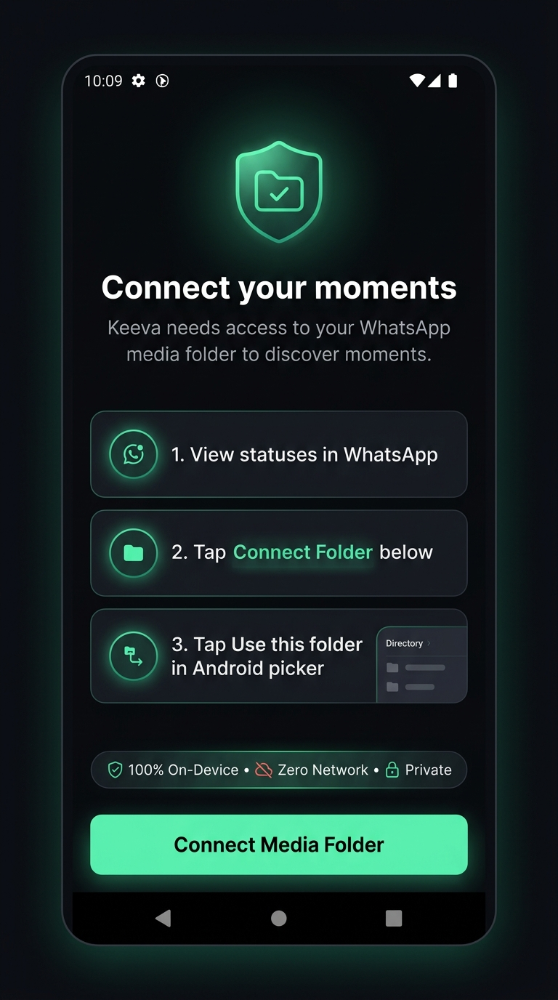
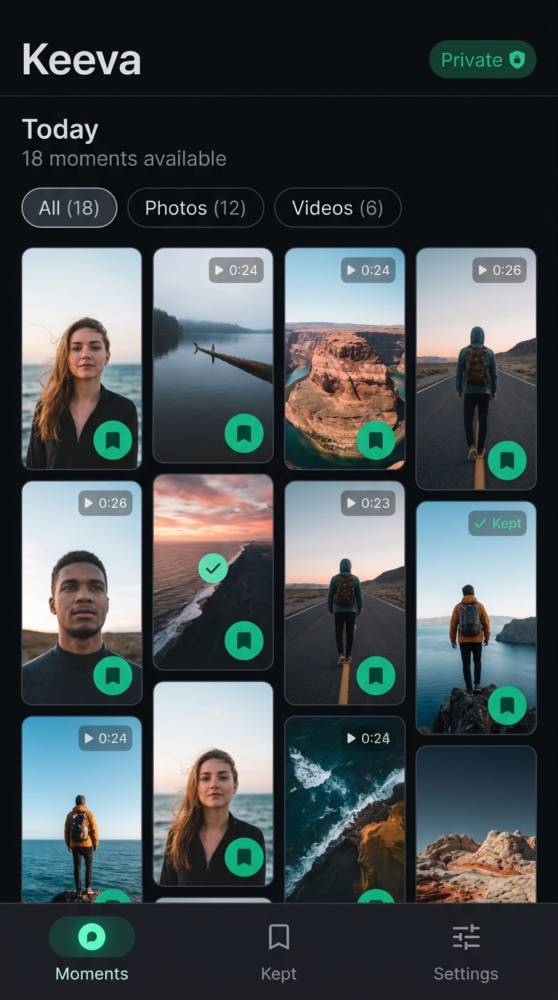
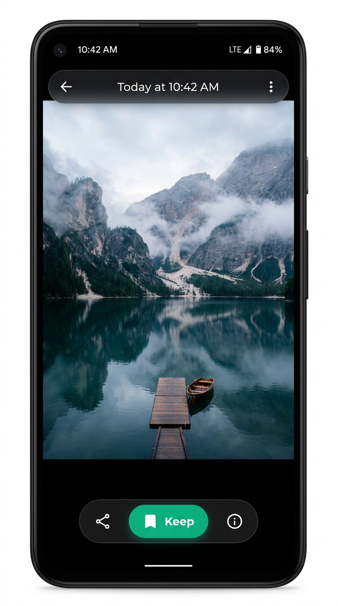

# Keeva UI/UX Screen & Wireframe Specification

**Product:** Keeva (WhatsApp Status Saver → Premium Independent Identity)
**Document Status:** Production UI/UX Screen Specification
**Phase:** Phase 2E-A (UI/UX Design System Discovery & Specification)
**Theme:** Quiet Obsidian + Aurora Mint
**Platform Target:** Android-First (Primary), iOS-Compatible (Secondary)
**Date:** September 2026

---

## 1. Information Architecture & Navigation Model

Keeva is structured around three core destinations:

```
                              ┌─────────────────────────┐
                              │       APP LAUNCH        │
                              └────────────┬────────────┘
                                           │
                                    Storage Access?
                                  ┌────────┴────────┐
                                 YES                NO
                                  │                 │
                                  │        ┌────────▼────────┐
                                  │        │ 3-STEP ONBOARD  │
                                  │        │ (SAF Auth Flow) │
                                  │        └────────┬────────┘
                                  │                 │
                                  └────────┬────────┘
                                           │
                        ┌──────────────────┴──────────────────┐
                        │                                     │
           ┌────────────▼────────────┐           ┌────────────▼────────────┐
           │     PHONE LAYOUT        │           │     TABLET LAYOUT       │
           │  (Bottom Navigation)    │           │   (Navigation Rail)     │
           └────────────┬────────────┘           └────────────┬────────────┘
                        │                                     │
         ┌──────────────┼──────────────┐       ┌──────────────┼──────────────┐
         ▼              ▼              ▼       ▼              ▼              ▼
     [MOMENTS]       [KEPT]       [SETTINGS] [MOMENTS]     [KEPT]       [SETTINGS]
   (Live Inbox)   (Saved Vault)   (Prefs/SAF)
```

### 1.1 Form Factor Adaptation
* **Phone (< 600dp width):** Fixed 64dp bottom navigation bar with translucent surface and active pill indicator.
* **Tablet / Landscape (>= 600dp width):** Left-docked adaptive navigation rail (80dp compact or 220dp expanded) with Keeva logo mark at top and Privacy Trust Pill at bottom.

---

## 2. Screen Specifications

---

### Screen A: Permission Onboarding (First-Run SAF Flow)



#### Visual ASCII Layout
```
┌─────────────────────────────────────────┐
│ [10:09]                             84% │
│                                         │
│                 ╭─────╮                 │
│                │ 🛡️📂 │                 │  <-- Shield Enclave Icon with Mint Glow
│                 ╰─────╯                 │
│                                         │
│          Connect your moments           │  <-- Display Medium (28sp SemiBold)
│      Keeva needs access to your WhatsApp│  <-- Body Medium (14sp textSecondary)
│      media folder to discover moments.  │
│                                         │
│   ┌─────────────────────────────────┐   │
│   │ [1]  1. View statuses in        │   │  <-- Step 1 Card (Surface Level 1)
│   │      WhatsApp                   │   │
│   ├─────────────────────────────────┤   │
│   │ [2]  2. Tap Connect Folder below│   │  <-- Step 2 Card (Surface Level 1)
│   ├─────────────────────────────────┤   │
│   │ [3]  3. Tap "Use this folder"   │   │  <-- Step 3 Card (Highlighted Border)
│   │      in Android picker          │   │
│   └─────────────────────────────────┘   │
│                                         │
│   ┌─────────────────────────────────┐   │
│   │  🛡️ 100% On-Device • 🔕 Zero Net│   │  <-- Privacy Guarantee Pill
│   │       • 🔒 Private              │   │
│   └─────────────────────────────────┘   │
│                                         │
│   ┌─────────────────────────────────┐   │
│   │      Connect Media Folder       │   │  <-- Primary CTA (Aurora Mint #10B981)
│   └─────────────────────────────────┘   │
│                                         │
│       Learn how Keeva protects you      │  <-- Secondary Text Action (12sp)
└─────────────────────────────────────────┘
```

#### Detailed Specification
1. **Purpose:** Guides users through Android's Storage Access Framework (SAF) folder picker with clear expectations, complete transparency, and zero technical jargon.
2. **Copy Hierarchy:**
   * **Headline:** "Connect your moments"
   * **Subhead:** "Keeva needs access to your WhatsApp media folder to discover moments."
   * **Step 1:** "View statuses in WhatsApp" (Explains that statuses only exist on-device once viewed in WhatsApp).
   * **Step 2:** "Tap Connect Folder below" (Prepares the user for the OS file dialog).
   * **Step 3:** "Tap 'Use this folder' in Android picker" (Explicitly quotes Android's system button).
   * **Trust Badge:** "100% On-Device • Zero Network • Private"
   * **CTA Label:** "Connect Media Folder"
3. **States:**
   * **Initial/Idle:** Shows the 3 steps, active mint CTA button.
   * **Requesting:** CTA enters loading state (indeterminate circular indicator inside button), screen disables duplicate taps while Android `DocumentsUI` is active.
   * **Granted:** Translucent toast/overlay appears with animated mint checkmark: "Connected safely. Discovering moments..." and transitions automatically to Moments Home.
   * **Declined/Cancelled:** Sheet remains visible, gentle notification banner appears: *"Folder selection is required to view statuses. Tap Connect whenever you're ready."*
   * **Wrong Folder Selected:** Clear warning banner: *"Please select the WhatsApp media folder so Keeva can discover moments."* with a "Try Again" button.
4. **Accessibility:**
   * TalkBack reads: *"Connect your moments. Three steps required: Step 1: View statuses in WhatsApp. Step 2: Tap Connect Folder below. Step 3: Tap Use this folder in Android picker. Button: Connect Media Folder."*
   * Touch target on CTA is 52dp height, exceeding the 48dp requirement.

---

### Screen B: Moments Home (Primary Screen)



#### Visual ASCII Layout
```
┌─────────────────────────────────────────┐
│ Keeva                      [🔒 Private] │  <-- Top Bar (Title + Trust Pill)
│                                         │
│ Today                                   │  <-- Headline Large (24sp SemiBold)
│ 18 moments available                    │  <-- Body Small (12sp textSecondary)
│                                         │
│ [ All (18) ] [ Photos (12) ] [ Videos (6) ] <-- Compact Filter Chips
│                                         │
│ ┌───────────────┐  ┌───────────────┐    │
│ │               │  │      [▶ 0:24] │    │  <-- 9:16 Vertical Cards
│ │               │  │               │    │      (2 columns on mobile)
│ │               │  │               │    │
│ │          (🔖) │  │          (🔖) │    │  <-- Signature Keep Button
│ └───────────────┘  └───────────────┘    │
│ ┌───────────────┐  ┌───────────────┐    │
│ │               │  │      [✓ Kept] │    │  <-- Kept Status Badge
│ │               │  │               │    │
│ │          (🔖) │  │          (✓)  │    │
│ └───────────────┘  └───────────────┘    │
│                                         │
│ [  Moments  ]   [    Kept   ]  [ Settings ] <-- Bottom Navigation Bar (64dp)
└─────────────────────────────────────────┘
```

#### Detailed Specification
1. **Top App Bar:**
   * **Left:** Brand wordmark "Keeva" in Plus Jakarta Sans SemiBold (22sp, `#F9FAFB`).
   * **Right:** "Private" Trust Pill (24dp height, emerald border, lock icon). Tapping opens Privacy Sheet explaining local-only storage.
2. **Contextual Header:**
   * "Today" (or date section header).
   * Status count subtitle: "18 moments available" (using tabular figures).
3. **Filter Chips:**
   * "All (18)", "Photos (12)", "Videos (6)".
   * Selected chip: Surface Level 2 background (`#1E232E`), mint border (`#10B981`), white text.
   * Unselected chips: Surface Level 1 background (`#161A22`), textSecondary (`#9CA3AF`).
4. **Media Grid:**
   * **Aspect Ratio:** Staggered vertical `9:16` grid (reflects WhatsApp story aspect ratio).
   * **Columns:** 2 columns on phones (< 600dp), 3 columns on small tablets (600-840dp), 4-5 columns on large tablets (> 840dp).
   * **Spacing:** 8dp horizontal and vertical gutter.
5. **Card Elements:**
   * **Image/Video Thumbnail:** Decoded in background isolate via native `getThumbnail` pipeline.
   * **Video Badge:** Top-right pill (`rgba(0,0,0,0.65)`, play icon + duration `0:24` in tabular figures).
   * **Keep Button:** Bottom-right circular pill (32dp visual affordance, 48dp hit box). Mint bookmark icon.
   * **Kept Badge:** If already saved, displays mint pill badge with checkmark (`✓ Kept`).
6. **Refresh Interaction:**
   * Swipe-to-refresh (pull down) triggers `statusListNotifierProvider.notifier.refresh()`. Non-blocking mint progress indicator at top.

---

### Screen C: Status Card (Atomic Component)

```
┌───────────────────────────┐
│ [✓ Kept]         [▶ 0:24] │  <-- Top Row: Kept Badge (left) & Video Duration (right)
│                           │
│                           │
│                           │  <-- 9:16 Media Thumbnail (Corner Radius: 12dp)
│                           │      1px Border: rgba(255, 255, 255, 0.06)
│                           │
│                           │
│ 14m ago              (🔖) │  <-- Bottom Row: Freshness label & Quick Keep Button
└───────────────────────────┘
```

#### Detailed States
1. **Idle (Unsaved):** Visual Keep button has subtle translucent dark backing (`rgba(0,0,0,0.50)`), mint bookmark icon (`#10B981`).
2. **Pressed:** Scales down to `0.94` with `HapticFeedback.lightImpact()`.
3. **Saving:** Keep button shows 16dp spinning circular indicator in mint.
4. **Saved (Success):** Morphs into solid mint checkmark (`#10B981`) with soft expansion pulse; top-left badge updates to `[✓ Kept]`.
5. **Already Kept:** Shows subtle checkmark. Tapping triggers options modal ("View in Kept Vault" or "Keep Copy").
6. **Save Failure:** Keep button flashes amber warning icon with haptic notification feedback (`HapticFeedback.mediumImpact()`).

---

### Screen D: Full Media Viewer (Immersive Shell)



#### Visual ASCII Layout
```
┌─────────────────────────────────────────┐
│ [←]         Today at 10:42 AM       [⋮] │  <-- Floating Glass Top Bar (48dp)
│                                         │
│                                         │
│                                         │
│                                         │
│            [FULL-SCREEN MEDIA           │  <-- Full 9:16 Photo or Video Stream
│             INTERACTIVE CANVAS]         │      Pinch-to-zoom (up to 3x)
│                                         │      Swipe-down to dismiss
│                                         │
│                                         │
│                                         │
│                                         │
│   ┌─────────────────────────────────┐   │
│   │   [🔗 Share]   [🔖 Keep]  [ℹ️ Info]│   │  <-- Floating Bottom Pill Bar
│   └─────────────────────────────────┘   │
│                   ━                     │  <-- Android Gesture Pill Inset
└─────────────────────────────────────────┘
```

#### Detailed Specification
1. **Canvas Treatment:** Pitch black (`#000000`) background in full-screen mode to provide edge-to-edge optical purity for photos and video.
2. **System Bars:** Immersive edge-to-edge layout with translucent scrim over status bar and navigation bar.
3. **Top Chrome:**
   * Back button (48×48dp touch target).
   * Title: Relative timestamp ("Today at 10:42 AM").
   * Overflow menu (`⋮`): "Media Details", "Share via...", "Open with...".
4. **Bottom Floating Pill Bar:**
   * Surface Level 2 container (`#1E232E`) with 24dp radius, elevated over media.
   * Actions:
     * **Share:** Native Android share intent.
     * **Keep Button (Signature):** Prominent mint pill (`#10B981`) with label "Keep" and bookmark icon. If already saved, reads "Kept ✓".
     * **Info:** Bottom sheet showing resolution, file size, storage URI, discovery date.
5. **Dismiss Gestures:**
   * Swipe down with finger translates image vertically. Scrim opacity fades linearly. Crossing 120dp threshold smoothly pops the viewer back to the originating grid card via hero animation.
   * Single tap anywhere on media toggles top and bottom chrome visibility.

---

### Screen E: Kept Media Vault

#### Visual ASCII Layout
```
┌─────────────────────────────────────────┐
│ Kept Vault                  [🔍]   [⋮] │  <-- Top Bar (Title + Search + Filter)
│                                         │
│ 42 moments safely kept                  │  <-- Subtitle (Tabular figures)
│ 128 MB stored in Pictures/SavedStatus   │  <-- Storage Footprint Indicator
│                                         │
│ [ All (42) ] [ Photos (28) ] [ Videos (14) ] <-- Filter Chips
│                                         │
│ ┌───────────────┐  ┌───────────────┐    │
│ │               │  │      [▶ 0:45] │    │  <-- Kept Media Grid
│ │               │  │               │    │      Saved in Android MediaStore
│ │  Yesterday    │  │  Sep 2        │    │      Survives WhatsApp 24h wipe
│ └───────────────┘  └───────────────┘    │
│                                         │
│ [  Moments  ]   [    Kept   ]  [ Settings ]
└─────────────────────────────────────────┘
```

#### Detailed Specification
1. **Purpose:** The permanent gallery of preserved moments.
2. **Product Vocabulary:** Strictly uses "Kept", "Vault", "Safely Preserved". Never "Downloads".
3. **Storage Indicator:** Discreetly shows total storage consumed (`128 MB`) and destination album name (`Pictures/SavedStatus` or `Movies/SavedStatus`).
4. **Multi-Selection:** Long-pressing any card activates multi-select mode: top bar transforms into counter ("3 selected") with batch actions ("Share", "Export to Album", "Delete").

---

### Screen F: Comprehensive Empty States (7 Distinct Scenarios)

Generic "No data" screens cause user confusion and support tickets. Keeva implements 7 dedicated, human-friendly empty states:

| State Code | Scenario | Graphic / Icon | Primary Message | Subtitle & Guidance | Action Button |
| :--- | :--- | :--- | :--- | :--- | :--- |
| **ES-01** | **No SAF Access Granted** | Glowing Shield Folder | "Connect your moments" | "Select your WhatsApp media folder to discover statuses before they expire." | "Connect Media Folder" |
| **ES-02** | **No Statuses on Device** | Clean Calendar Spark | "No moments right now" | "Statuses appear here after you view them in WhatsApp. Go view a few statuses and return." | "Open WhatsApp" |
| **ES-03** | **No New Moments (Filtered)**| Filter funnel icon | "No matching moments" | "No moments match the active filter. Switch filters to view all available statuses." | "Show All Moments" |
| **ES-04** | **No Kept Moments Yet** | Empty Bookmark Vault | "Your vault is empty" | "Keep your favorite moments before they vanish in 24 hours. Tapping Keep saves them forever." | "Explore Moments" |
| **ES-05** | **Folder Unavailable / Moved**| Broken Link / Folder | "Media folder unavailable"| "Android could not reach the connected folder. WhatsApp may have updated its storage location." | "Reconnect Folder" |
| **ES-06** | **Permission Revoked by OS** | Security Alert Shield| "Access needs renewal" | "Android permissions were reset or revoked. Reconnect your folder in one tap." | "Renew Access" |
| **ES-07** | **Media Deleted by Sender** | Clock / Ghost | "Moment expired" | "This moment was removed or expired before it could be saved." | "Return to Moments" |

---

### Screen G: Error States & Calm Recovery

Errors must remain calm, non-technical, and actionable.

```
┌─────────────────────────────────────────┐
│                 ╭───╮                   │
│                │ ⚠️  │                  │  <-- Soft Amber Warning Icon
│                 ╰───╯                   │
│         Unable to keep moment           │  <-- Headline (18sp SemiBold)
│                                         │
│   Your device storage might be full     │  <-- Calm explanation
│   or permission was temporarily blocked.│
│                                         │
│   ┌─────────────────────────────────┐   │
│   │            Try Again            │   │  <-- Primary Recovery Action
│   └─────────────────────────────────┘   │
│                                         │
│             Check Storage               │  <-- Secondary Option
└─────────────────────────────────────────┘
```

#### Error Copy Rules
* **BANNED WORDS:** `PlatformException`, `SAF`, `ContentResolver`, `URI`, `DocumentId`, `Kotlin`, `NullPointerException`, `I/O Error`.
* **ALLOWED HUMAN COPY:** "Unable to load thumbnail", "Folder disconnected", "Storage full", "Moment unavailable".

---

## 3. UI State Mapping (Phase 2D Riverpod Integration)

Every state emitted by the Phase 2D Riverpod layer maps deterministically to a visual UI representation:

```
RIVERPOD STATE (Phase 2D)         UI PRESENTATION LAYER (Phase 2E)
──────────────────────────────────────────────────────────────────────────────────────────
AccessState.initial()             → Splash Screen shimmer / initializing
AccessState.checking()            → Centered discreet circular progress
AccessState.notGranted()          → Screen A: 3-Step Permission Onboarding
AccessState.requesting()          → Onboarding CTA shows inline spinner (modal blocked)
AccessState.granted()             → Screen B: Moments Home Screen (load statuses)
AccessState.revoked()             → Screen F (ES-06): "Access needs renewal" empty state
AccessState.unavailable()         → Screen F (ES-05): "Media folder unavailable" recovery
──────────────────────────────────────────────────────────────────────────────────────────
StatusListState.initial()         → Pre-load state (empty list container)
StatusListState.loading()         → Staggered 6-card shimmer skeleton grid
StatusListState.refreshing()      → Non-destructive top linear progress indicator (list stays visible)
StatusListState.success(items)    → Screen B: Populated 9:16 media grid
StatusListState.empty()           → Screen F (ES-02): "No moments right now"
StatusListState.failure(error)    → Screen G: Calm recovery card with "Retry" action
──────────────────────────────────────────────────────────────────────────────────────────
SaveState.initial()               → Keep Button in default idle state (Mint bookmark)
SaveState.inProgress(id)          → Specific card's Keep Button shows 16dp spinner
SaveState.success(id, uri)        → Button morphs to solid mint checkmark + light haptic tap
SaveState.alreadySaved(id)        → Button displays "Kept ✓" subdued badge
SaveState.failure(id, error)      → Button flashes amber warning icon + snackbar notification
──────────────────────────────────────────────────────────────────────────────────────────
ViewerState.initial()             → Blank viewer canvas
ViewerState.preparing(id)         → Centered dark shimmer indicator over black canvas
ViewerState.ready(media)          → Screen D: Full-screen interactive media canvas + controls
ViewerState.failure(error)        → Screen G: "Moment unavailable" modal with back action
```

---

## 4. Responsive Layout & Adaptive Grid Rules

Keeva dynamically adapts to the user's display size and orientation:

```
Screen Width Range       Device Category            Grid Columns   Gutter   Navigation Model
──────────────────────────────────────────────────────────────────────────────────────────
< 360dp                  Compact Phone (e.g. A03)   2 columns      6dp      Bottom Bar (48dp icons)
360dp – 599dp            Standard Phone (AMOLED)    2 columns      8dp      Bottom Bar (64dp standard)
600dp – 839dp            Tablet Portrait / Foldable 3 columns      12dp     Left Navigation Rail (80dp)
840dp – 1199dp           Tablet Landscape           4 columns      16dp     Left Navigation Rail (220dp)
>= 1200dp                Desktop / Large Tablet     5 columns      16dp     Left Navigation Rail (240dp)
```

* **Grid Aspect Ratio:** Fixed at `0.5625` (equivalent to `9:16`) for story media.
* **SafeArea Handling:** Grid bottom content padding includes navigation bar height + system gesture insets (`MediaQuery.viewPaddingOf(context).bottom + 72dp`) so the bottom-most cards are never obscured.
