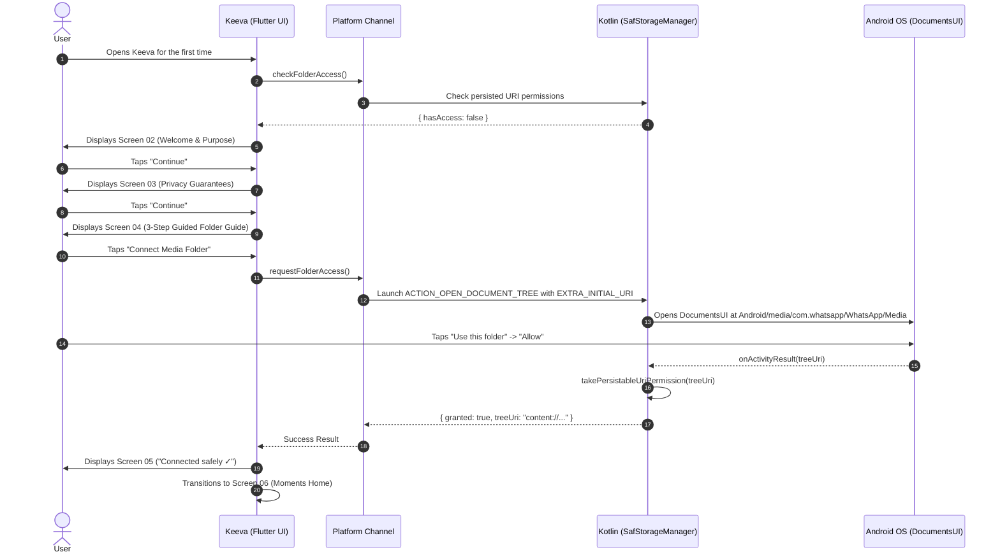
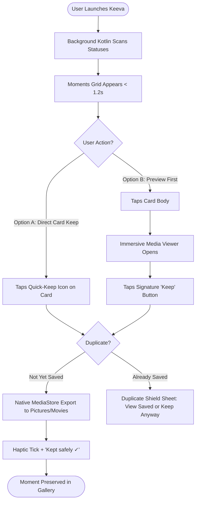
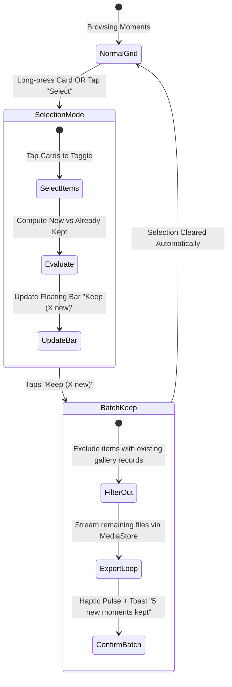
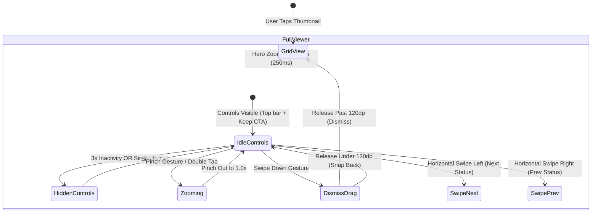
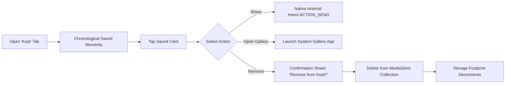
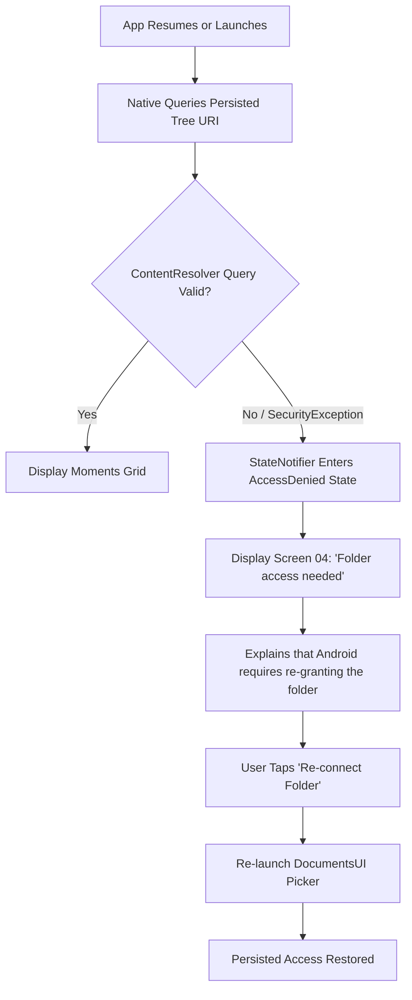

# User Flows & Interaction State Machines

**Product:** Keeva (WhatsApp Status Saver → New Product Identity)  
**Document Status:** Approved Interaction Architecture  
**Design Phase:** Phase 2E-A (Product Brand & UI/UX Design System)  
**Authors:** Senior Mobile UX Architect  
**Date:** September 2026  

---

## 1. Flow 1: First-Time User Onboarding & SAF Folder Grant

This flow guides the user from cold initial app launch through the required Android Storage Access Framework (SAF) folder authorization with zero confusion and zero technical jargon.



### Flow 1 Failure & Recovery Paths
- **User Cancels System Picker:** Native returns `granted: false`. Keeva displays Screen 04 with a gentle prompt: *"Folder connection is required to discover your statuses. Tap Connect whenever you're ready."*
- **User Selects Wrong Folder:** Native checks if the selected tree URI contains `.Statuses` or `com.whatsapp`. If completely unrelated, native flags a warning: *"Selected folder does not look like WhatsApp Media. Tap here to re-select."*

---

## 2. Flow 2: Quick-Keep Single Moment (<5s Target)

The hallmark of Keeva is an ultra-fast, frictionless path to preserve a status update before it expires.

```
                  THE 5-SECOND KEEP PROMISE
                  
   [OPEN APP]  ──►  [SEE MOMENTS]  ──►  [TAP QUICK-KEEP]  ──►  [KEPT SAFELY ✓]
     0.0s               1.2s                 2.4s                 3.1s
```



---

## 3. Flow 3: Multi-Select Batch Keep with Duplicate Shield

When a user has viewed multiple statuses (e.g., from a wedding or event) and wants to save 10 items at once without creating duplicate files in their device gallery.



### Duplicate Shield Calculation Logic
If user selects 8 total items where 5 are new and 3 have existing entries in `KeptMedia`:
1. The primary button label renders: **"Keep 5 new"** (with secondary micro-caption: *"3 already in gallery"*).
2. Tapping the button saves only the 5 new items, saving precious device storage and avoiding gallery clutter.
3. If user explicitly wants duplicates, an overflow menu provides: *"Force keep all 8"*.

---

## 4. Flow 4: Immersive Media Viewing & Gesture Navigation



---

## 5. Flow 5: Managing Kept Media & Sharing



---

## 6. Flow 6: Storage & Cache Management in Settings

```mermaid
flowchart TD
    OpenSettings[Open Settings Screen] --> StorageSection[Inspect Storage & Cache]
    StorageSection --> Metrics[Display: Thumbnails 24 MB | Videos 48 MB | Gallery 1.2 GB]
    Metrics --> TapClear[User Taps 'Clear Temporary Caches']
    TapClear --> Confirm[Dialog: Temporary playback files will be cleared. Saved gallery items unaffected.]
    Confirm --> NativePurge[Kotlin deletes internal cacheDir files]
    NativePurge --> ResetMetrics[Thumbnails: 0 MB | Videos: 0 MB]
    ResetMetrics --> Feedback[Toast: 'Cache cleared safely']
```

---

## 7. Flow 7: Permission Revocation Recovery Flow

Handles the critical edge case where a user revokes folder permission from Android OS App Settings or uninstalls WhatsApp.


